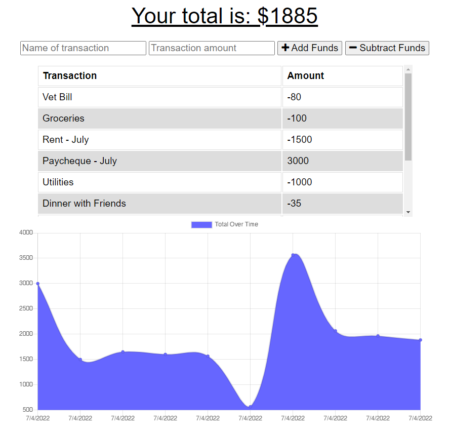

  # Budget Tracker (PWA)
  
  This progressive web application is a budgeting app that provides offline functionality. Using indexedDB to store offline requests and service workers to serve resources to the client in the absence of a network connection, this application tracks and graphs a user's income and expenses using MongoDB.
  
  ## Table of Contents
  
  * [Installation](#installation)
  * [Built With](#built)
  * [Usage Information](#usage)
  * [Authors & Acknowledgements](#credits)
  * [Contact](#questions)
  
  ## Installation
  This application can be accessed at its deployed Heroku link.

  ## Built With
  * HTML
  * CSS
  * JavaScript
  * Express.js
  * IndexedDB
  * MongoDB
  * MongoDB Atlas
  * Heroku
  * Mongoose
  
  ## Usage Information
  [Budget Tracker](https://gorgeous-canyonlands-37122.herokuapp.com/) 
    
  This is a demonstration only application, since it does not support calculations and graphing for individuals users and does not provide a sign in/out function. 
    
    
  
  ## Authors & Acknowledgements
  
  Base code © 2020 - 2022 Trilogy Education Services, a 2U, Inc. brand. All Rights Reserved. 
  Made by [TOVTC](https://github.com/TOVTC). 
  Originally submitted 2022July04.
  
  ## Questions?
  Contact repository author via [GitHub](https://github.com/TOVTC). 

## Assignment Information - Progressive Web Applications (PWA) Challenge: Budget Tracker
### User Story
AS AN avid traveler 
I WANT to be able to track my withdrawals and deposits with or without a data/internet connection 
SO THAT my account balance is accurate when I am traveling

### Acceptance Criteria
GIVEN a budget tracker without an internet connection 
WHEN the user inputs an expense or deposit 
THEN they will receive a notification that they have added an expense or deposit 
WHEN the user reestablishes an internet connection 
THEN the deposits or expenses added while they were offline are added to their transaction history and their totals are updated